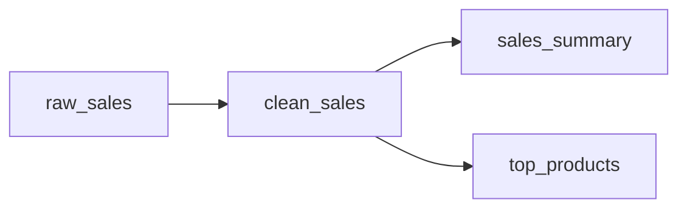

Dagster Workshop: Asset-Oriented Orchestration
----------------------------------------------
*30-minute hands-on experience*

# 1. Setup 

### 1.1 Install Dagster

```bash
uv add dagster dagster-webserver pandas
```

### 1.2. Create Sample Data

Create a file called `sales_data.csv`:

```csv
date,product,quantity,price,region
2024-01-01,Widget A,10,25.50,North
2024-01-01,Widget B,5,40.00,South
2024-01-02,Widget A,8,25.50,North
2024-01-02,Widget C,12,15.75,East
2024-01-03,Widget B,15,40.00,South
2024-01-03,Widget A,6,25.50,West
```

# 2. Building Your First Asset 



## Step 2.1: Create Your raw_sales assets 

Create `assets.py`:

```python
import pandas as pd
from dagster import asset


@asset
def raw_sales_data():
    """Load raw sales data from CSV file."""
    return pd.read_csv("sales_data.csv")
```

**Key Points to Notice:**

- Each function is an **asset** - it represents data, not a task
- Type hints help with data contracts

## Step 2.2: Create Your Definitions file 

create `definitions.py`:`

```python
from dagster import Definitions, load_assets_from_modules
import assets

defs = Definitions(assets=load_assets_from_modules([assets]))
```

## Step 2.3: Start Dagster UI 

```bash
dagster dev -f definitions.py
```

Open your browser to `http://localhost:3000`

# 3. add clean_sales and sales_summary assets

## Step 3.1: add clean_sales and sales_summary assets 

edit `assets.py`:

```python
import pandas as pd
from dagster import asset


@asset
def raw_sales_data():
    """Load raw sales data from CSV file."""
    return pd.read_csv("sales_data.csv")


@asset
def clean_sales_data(raw_sales_data: pd.DataFrame) -> pd.DataFrame:
    """Clean and validate sales data."""
    # Remove any rows with missing values
    cleaned = raw_sales_data.dropna()

    # Add calculated fields
    cleaned["total_revenue"] = cleaned["quantity"] * cleaned["price"]
    cleaned["date"] = pd.to_datetime(cleaned["date"])

    return cleaned


@asset
def sales_summary(clean_sales_data: pd.DataFrame) -> pd.DataFrame:
    """Create daily sales summary by region."""
    summary = clean_sales_data.groupby(["date", "region"]).agg({
        "quantity": "sum",
        "total_revenue": "sum",
        "product": "nunique"
    }).round(2)

    summary.columns = ["total_quantity", "total_revenue", "unique_products"]
    return summary.reset_index()
```

**Key Points to Notice:**

- Each function is an **asset** - it represents data, not a task
- Dependencies are declared through **function parameters**
- Dagster automatically figures out execution order

### Step 3.2: reload definitions

**Explore:**

- Asset graph visualization
- See the dependencies: raw_sales_data → clean_sales_data → sales_summary

### Step 3.3: Materialize Your Assets 

In the Dagster UI:

1. Go to the **Assets** tab
2. Click **Materialize all**
3. Watch the execution in real-time
4. Explore the **Asset Details** for each asset

**What You're Seeing:**

- Asset catalog showing all your data
- Lineage visualization
- Execution logs per asset
- Data preview (if supported)

# Step 4: add top_products asset 

## 4.1 Add top_products asset as a new Downstream Asset

Add this to your `assets.py`:
this time we want to check how much we selled from each type of product globally

```python
@asset
def top_products(clean_sales_data: pd.DataFrame) -> pd.DataFrame:
    """Find top-selling products by revenue."""
    product_revenue = clean_sales_data.groupby("product").agg({
        "total_revenue": "sum",
        "quantity": "sum"
    }).sort_values("total_revenue", ascending=False)

    return product_revenue.reset_index()
```

## 4.2 Reload Definitions

1. Save the file
2. Refresh the UI
3. See how `top_products` automatically appears in the asset graph
4. Materialize just the new asset

# 5  Asset Checks

## 5.1 add Asset Checks

when working with assets it is quite straight forward to add checks to ensure that the data is as expected
in this step we will add a check to ensure that the sales_summary asset has data

```python


from dagster import asset_check, AssetCheckResult


@asset_check(asset=sales_summary)
def sales_summary_has_data(sales_summary):
    return AssetCheckResult(passed=len(sales_summary) > 0)
```

## 5.2 update the definition file

note that everything we add must also be added to the definitions file

```python
from dagster import Definitions, load_assets_from_modules, load_asset_checks_from_modules

import assets

defs = Definitions(
    assets=load_assets_from_modules([assets]),
    asset_checks=load_asset_checks_from_modules([assets]),
)
```

## 5.3 reload definitions

1. reload definition
2. materialize all assets
3. see the check results

# 6. assets metadata

## 6.1 add metadata to raw_sales_data

add metadata to raw_sales_data asset. add asset level metadata and also add metadata to the output of the asset

```python
@asset(owners=["richard.hendricks@hooli.com", "team:data-eng"])
def raw_sales_data():
    """Load raw sales data from CSV file."""
    df = pd.read_csv("sales_data.csv")
    return Output(
        df,
        metadata={
            "source_path": os.path.abspath("sales_data.csv"),
            "row_count": len(df),
            "columns": list(df.columns),
            "sample": MetadataValue.md(df.head(5).to_markdown(index=False)),
        },
    )
```

## 6.2 reload definitions

1. reload definitions
2. click raw_sales_data asset
3. click view in assets catalog
4. see metadata


# 7. Exploration & Questions 

## 7.1 Things to Try:

1. **Asset Lineage**: Click on any asset to see its upstream/downstream dependencies
2. **Asset Details**: View metadata, execution history, and data previews
3. **Dependency Exploration**: See how changing one asset affects others

## 7.2 Discussion Points:

**Compare to Airflow:**

- How would you build this same pipeline in Airflow?
- How many DAG files, tasks, and dependency declarations would you need?
- How would you track which data depends on what?

**Asset-Oriented Benefits:**

- **Data-first thinking**: You define what you want, not how to get it
- **Automatic lineage**: No manual tracking of data flow
- **Easy exploration**: Browse your data like a catalog
- **Clear dependencies**: Function parameters = data dependencies

## 7.3 Key Takeaways:

1. **Mental shift**: From "execute these tasks in order" to "these assets depend on those assets"
2. **Declarative**: Describe your data pipeline, don't script the execution
3. **Lineage comes free**: No extra work to track data dependencies
4. **Asset catalog**: Your data pipeline becomes browsable and discoverable

# 8. Add Schedules (optional)

add job definition:

```python
# jobs.py
from dagster import define_asset_job, AssetSelection

all_assets_job = define_asset_job(
    name="all_assets_job",
    selection=AssetSelection.all(),
    description="Materialize all assets.",
)
```

```python
# schedules.py
from dagster import ScheduleDefinition
from jobs import all_assets_job

daily_schedule = ScheduleDefinition(
    name="daily_6am",
    cron_schedule="0 6 * * *",
    job=all_assets_job,
    # Optional: set your preferred timezone (defaults to instance timezone or UTC)
    execution_timezone="UTC",
)
```

update definition

```python
from dagster import Definitions, load_assets_from_modules
import assets
from jobs import all_assets_job
from schedules import daily_schedule

defs = Definitions(
    assets=load_assets_from_modules([assets]),
    jobs=[all_assets_job],
    schedules=[daily_schedule],
)
```

## Workshop Wrap-up Questions

1. **How does this feel different from task-based orchestration?**
2. **What would be challenging about adopting this approach?**
3. **What use cases from your work would benefit from asset-oriented thinking?**
4. **When would you still prefer Airflow or simpler tools?**

---

## File Structure Summary

```
dagster-workshop/
├── sales_data.csv
└── assets.py
```

**Commands to remember:**

- `dagster dev` - Start local development server
- Navigate to `http://localhost:3000` for UI